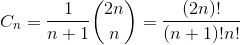

## 各种公式

### 斯特林公式:

斯特林公式（Stirling's approximation）是一条用来取n的[阶乘](https://baike.baidu.com/item/%E9%98%B6%E4%B9%98)的[近似值](https://baike.baidu.com/item/%E8%BF%91%E4%BC%BC%E5%80%BC)的数学公式。一般来说，当n很大的时候，n阶乘的计算量十分大，所以斯特林公式十分好用，而且，即使在n很小的时候，斯特林公式的取值已经十分准确。


或更精确的


或


## 卡特兰数：

卡塔兰数是组合数学中一个常在各种计数问题中出现的数列。以比利时的数学家欧仁·查理·卡特兰（1814–1894）命名。历史上，清代数学家明安图(1692年－1763年)在其《割圜密率捷法》最早用到“卡塔兰数”，远远早于卡塔兰[1][2。有中国学者建议将此数命名为“明安图数”或“明安图-卡塔兰数”

前20项为（[OEIS](https://zh.wikipedia.org/wiki/%E6%95%B4%E6%95%B8%E6%95%B8%E5%88%97%E7%B7%9A%E4%B8%8A%E5%A4%A7%E5%85%A8)中的数列[A000108](https://oeis.org/A000108)）：1, 1, 2, 5, 14, 42, 132, 429, 1430, 4862, 16796, 58786, 208012, 742900, 2674440, 9694845, 35357670, 129644790, 477638700, 1767263190

公式:


C_n的另一个表达形式为

所以，Cn是一个自然数；这一点在先前的通项公式中并不显而易见。这个表达形式也是André对前一公式证明的基础

### 日期问题--基姆拉尔森公式

通过日期可以推算出星期几:

```cpp
int day(int y,int m,int d)  
{  
    if(m==1||m==2)  
    {  
        m+=12;  
        y-=1;  
    }  
    int w=(d+2*m+3*(m+1)/5+y+y/4-y/100+y/400+1)%7;  
    return w;  
}  
int runnian(int a)  
{  
    if((a % 4 == 0 && a % 100 != 0) || a % 400 == 0)  
        return 1;  
    else  
        return 0;  
}  
```

### 斐波那契通项

$$F_{n} = \frac{1}{\sqrt{5} }[(\frac{1+\sqrt{5} }{2})^n -  (\frac{1-\sqrt{5} }{2})^n]$$

### 排列数和组合数

$$A^m_n=\frac{n!}{(n-m)!}$$

$$C^m_n=\frac{n!}{m!(n-m)!}$$

$$C^m_n=C^{m-1}_{n-1}+C^{m}_{n-1}$$

### 其他常用公式

1. n个点的无向图，任意三点不能直接到达，最大道路数量:$$\frac{n}{2}\times(n-\frac{n}{2})$$

